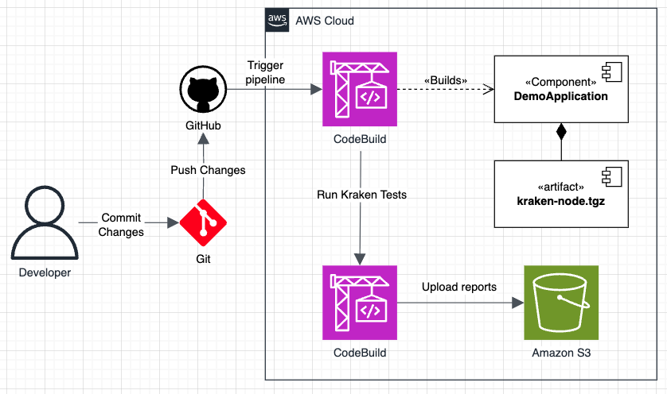

# Ejemplo de aplicación Kraken

Proyecto de ejemplo para modernización de software.



### Requisitos

- Node.js >= 20
- NPM >= 10

### Compilar Kraken

Instale y compile Kraken antes de iniciar. Para ello, abra una terminal en la raíz de este repositorio y ejecute:

1. Instalar dependencias: `npm install`
2. Compilar Kraken: `npm run build`

⚠️ Importante: Cuando modifique el código de Kraken, debe recompilarlo antes de ejecutar las pruebas.

### Ejecución en local

Navegue al directorio de esta aplicación a través de la terminal y ejecute:

3. Cambiar de directorio: `cd examples/kraken-demo`
4. Instalar dependencias: `npm install`
5. Correr pruebas: `npm run test`

### Pipeline de integración continua

Defina las variables de entorno `CI=1` y `ONLY_WEB=1` durante el pipeline para ejecutar las pruebas en modo headless.

```sh
CI=1 ONLY_WEB=1 npm run test
```
